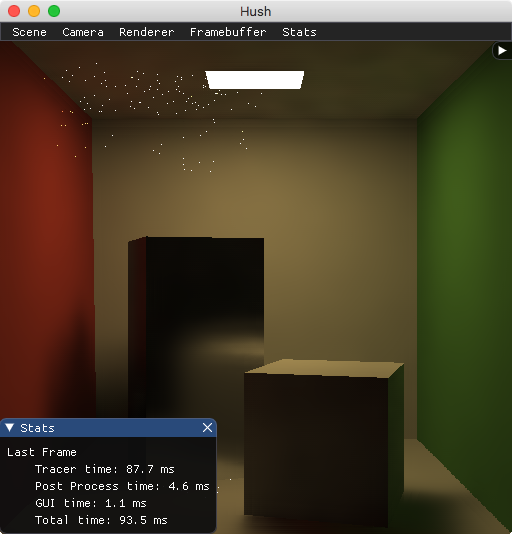

# hush
Hush is an interactive path tracer renderer with denoising. It renders static scenes with an interactive camera. 

Hush organizes modular render passes in a pipeline architecture. Both CPU and GPU passes can combine to make hybrid rendering pipelines. The modularity and buffer abstraction allows for experimentation and development of new passes and pipelines. Each render pass can configure its necessary input buffers from any previous output buffer of the same type.

Hush also provides a GUI. Hush can run-time modify rendering settings to further experiment and learn how rendering strategies and choices affect framerate and image quality.

The primary goal this project is to learn and implement path tracing and denoising concepts. Though the objective is still interctive (10 fps) framerates, the implementation approach trades performance for GUI features and ease of understanding.

## TODO / Features
* Rendering Strategies
  * Rasterization with OpenGL (Bare-bones deferred shading: no shadows, only point lights, phong shading)
  * CPU Path Tracing with GPU denoising
  
* Denoising Strategies
  * [Edge-Avoiding A-Trous Wavelet Transform](https://jo.dreggn.org/home/2010_atrous.pdf)

* Pipeline GUI
  * [x] Selectable output buffer to display

* Scene
  * Load obj scene files
  * GUI Enable / Disable mesh

* Lights
  * [x] Point
  * [x] Area from emissive mesh geometry
  
* Materials / BSDF models
  * [x] Lambertian
  * [x] [Glossy Phong](http://mathinfo.univ-reims.fr/IMG/pdf/Using_the_modified_Phong_reflectance_model_for_Physically_based_rendering_-_Lafortune.pdf)
  * [x] Diffuse Textures

## Compiling
Dependencies
- GLAD
- GLM
- GLFW3
- Threading Building Blocks (TBB)
- Embree

### MacOS & Linux
```
mkdir build
cd build
cmake -DCMAKE_BUILD_TYPE=Release ..
make
```
I tested compiling with GCC 8.2 and Clang 9.1 on macOS High Sierra and GCC 7.3 on Ubuntu 18.

### Windows
Untested. 

## Usage
From the binary directory,
```
./hush {file.obj}
```

For example, to run the Cornell Box sample scene
```
./hush ../../scenes/CornellBox/CornellBox-Original.obj
```

If the scene has no emissive geometries (or if you want additional light sources), activate lights through the GUI
```
Scene -> Edit Scene -> Lights -> Additional Lights
```

By default, Hush starts with simple OpenGL renderer to allow you to performantly setup proper camera position and lighting. To switch to Path Tracing, click F2.

Additional controls and settings can be found in the GUI.

## Example Scenes
The included example scenes are from:
http://casual-effects.com/data/index.html

## Demo
Note: rendering was performed on my 2015 Macbook Pro with a 2.7 GHz Intel i5-5257U (Intel Iris Graphics 6100) and 16 GB 1867 Mhz RAM 

### Cornell Box Original

Path Tracer (1 spp, 1 depth, 1 direct light sample per hit) with Atrous denoising. 9-10 FPS


[Tungsten Renderer](https://github.com/tunabrain/tungsten) Reference (1024 spp, 10 depth). 1h 30m 51s


### Cornell Box Mirror

Path Tracer (1 spp, 1 depth, 1 direct light sample per hit) with Atrous denoising. Note: high variance artifacts from specular reflection appear due to such a low spp.


