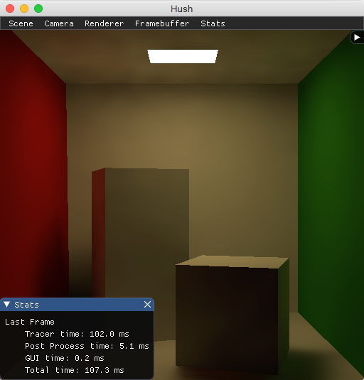
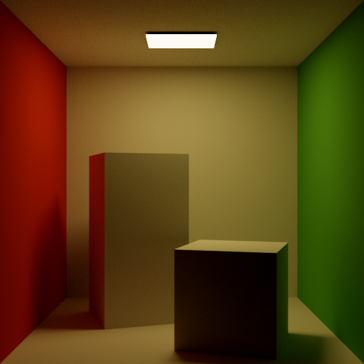

# hush
Hush is an interactive path tracer renderer with denoising. 

Hush renders static scenes with an interactive camera. Hush includes a simple GUI to change settings and strategies for rendering and denoising. 

Initially written for the final project of an undergraduate computer graphics course, Hush is a project to guide my self-education in rendering. 

## TODO / Features
* Rendering Strategies
  * [x] Rasterization with OpenGL (Bare-bones: no shadows, only point lights, phong shading)
  * [x] CPU Path Tracing (Backwards, Monte-Carlo, Multiple Importance Sampling on Light and BSDF)
  * [ ] GPU Path Tracing
  
* Denoising Strategies
  * [x] [Edge-Avoiding A-Trous Wavelet Transform](https://jo.dreggn.org/home/2010_atrous.pdf)
  * [ ] [Mara, McGuire, Bitterli, Jarosz](https://cs.dartmouth.edu/wjarosz/publications/mara17towards.html)
  * [ ] [Spatiotemporal Variance-Guided Filtering](https://cg.ivd.kit.edu/svgf.php)
  
* Lights
  * [x] Point
  * [ ] Directional
  * [x] Area from emissive mesh geometry
  * [ ] Environment Map
  * [ ] Default lighting for scenes without emissive geometry

* Materials / BSDF models
  * [x] Lambertian Diffuse
  * [ ] Specular
  * [ ] Transmissive
  * [ ] Glossy / Hybrid - (ex. [PBR Phong](http://mathinfo.univ-reims.fr/IMG/pdf/Using_the_modified_Phong_reflectance_model_for_Physically_based_rendering_-_Lafortune.pdf))
  
* Textures
  * [x] Diffuse
  * [ ] Specular
  * [ ] Transmissive
  * [ ] Bump Map
  
* GUI
  * [ ] Load scene files
  * [x] Enable / Disable mesh
  * [ ] Add / Edit lights
  * [ ] Edit material properties and BSDF model
  * [ ] Variable rendering resolution (currently locked 512x512)
  * [ ] Pipeline / Shader Graph


## Compiling
Dependencies
- GLAD
- GLM
- GLFW3
- Threading Building Blocks (TBB)
- Embree

### MacOS
```
mkdir build
cd build
cmake -DCMAKE_BUILD_TYPE=Release ..
make
```

### Windows & Linux
Untested. 

I tested compiling with GCU 8.2 and Clang 9.1 on MacOS, so I hope this runs on Linux, but I have little hope for Windows.

## Usage
From the binary directory,
```
./hush {file.obj}
```

For example, to run the Cornell Box sample scene
```
./hush ../../scenes/CornellBox/CornellBox-Original.obj
```

If the scene has no emissive geometries (or if you want additional light sources), activate lights through the GUI
```
Scene -> Edit Scene -> Lights -> Additional Lights
```

By default, Hush starts with simple OpenGL renderer to allow you to performantly setup proper camera position and lighting. To switch to Path Tracing, click F2.

Additional controls and settings can be found in the GUI.

## Example Scenes
The included example scenes are from:
http://casual-effects.com/data/index.html

## Demo
Note: rendering was performed on my 2015 Macbook Pro with 2.7 GHz Intel Core i5 and Intel Iris Graphics 6100

### Cornell Box

Path Tracer (1 spp, 1 depth, 1 direct light sample per hit) with Atrous denoising. 9-10 FPS



[Tungsten Renderer](https://github.com/tunabrain/tungsten) Reference (1024 spp, 10 depth). 1h 30m 51s


